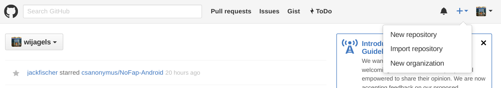
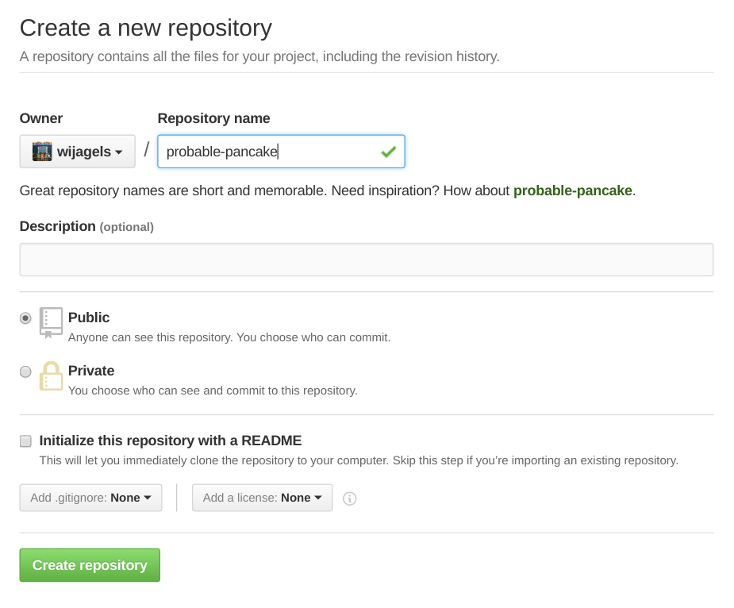
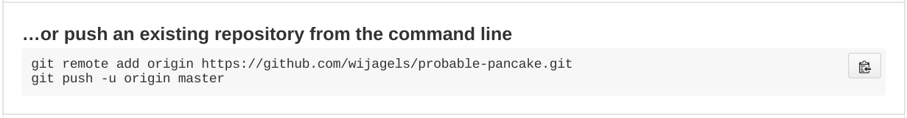

# Git Tutorial
## Getting ready
### Linux
Install git using your package manager eg. `sudo apt install git`.
### Mac OSX
Open a terminal and type `git`.
If you get a prompt to install xcode command line tools, let it install.
If you're impatient or want the latest version, you can install Git with this [download](https://git-scm.com/download/mac)
You may need to follow [this guide](https://github.com/timcharper/git_osx_installer#i-have-xcode-installed-and-consequently-its-bundled-git-how-do-i-get-my-system-to-use-this-version-instead) if you use the second option.
### Windows
You'll have to download Git and a Terminal from [here](https://git-for-windows.github.io/).

## Why Git?
- Keep a history of your work
- Undo bad changes
- Work on the same project with others
- Backup your code to the internet
- Try risky ideas

## What can I store in Git?
Short answer: anything!

Longer answer: Anything that is in a plain-text format (source code, text files, html) can be tracked by Git very well.
Binary files also can be tracked, but you shouldn't put certain binary files into Git.
You shouldn't add generated executable files and object-code (.class, .pyc) because those files can be built using the source code.
Images are generally okay to add, GitHub will even show the differences in images!

## So, how do I use it?
### Configure git
We need to tell git who you are first.
Type `git config --global user.email "youremail@binghamton.edu"` to set your email.
Then type `git config --global user.name "Johnny Hacker"` to set your name.

### Make a project 
In your terminal type `mkdir myproject` and `cd myproject` to create and enter a project directory.

To make your current directory a git repository, just type `git init`.

Now that you have a directory with git, you can use the directory just like any other directory.
Write or copy some files into the directory, and then type `git status`.
This will show you the current status of what's available to add to Git.
Under untracked files, you'll see the files that are in the directory, but not stored in Git.

### Saving changes
To start tracking a file, type `git add myfile.txt`.
This hasn't saved the changes yet because we need to ask git to do that first.
Add any other files with `git add otherfile.txt coolpicture.jpg etc.`.

When you're ready to save your changes, type `git status` to review what's going to be saved.
If it all looks good, type `git commit -m "Write something descriptive here"`.

To see what was saved, type `git show`. If you want to see a log of all of your previous commits, type `git log`.

## What about GitHub?
Now that you have a git repository on your computer, you might want to back it up somewhere safe.
By uploading your git repository to github, you'll let other people see what you're working on and allow others to help you make an awesome project.

### Make the repository

### Give it an interesting title

Make sure Initialize this repository is unchecked!
Since you already made the repo locally, we want to start with an empty repo.

### Follow the instructions

After running `git push -u origin master`, your code should be on GitHub!
If you make more changes, you can run `git push` after committing your files to send the changes to GitHub.
